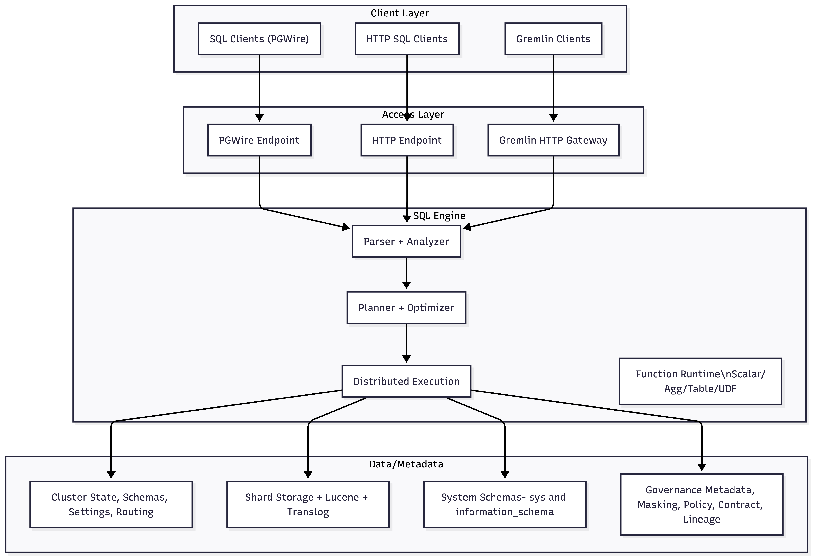
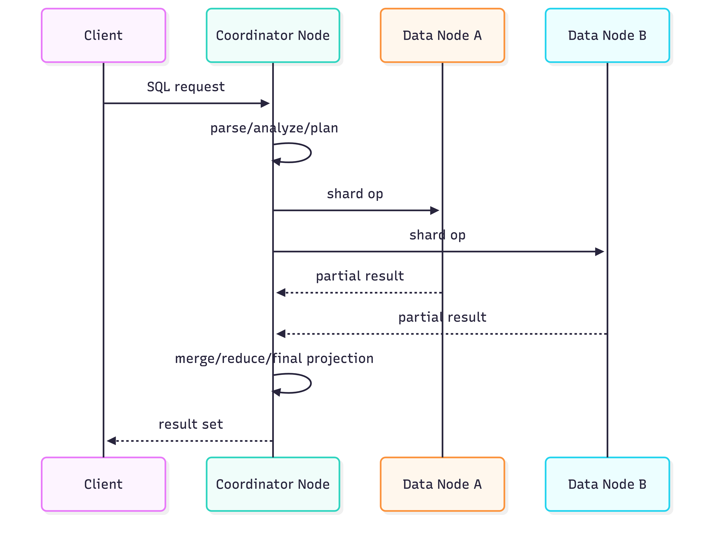
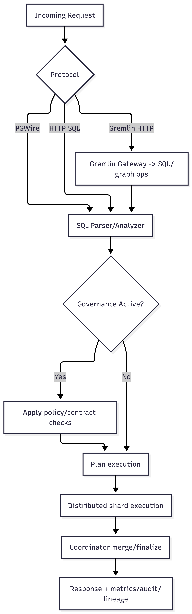

# Architecture Overview

MonkDB is a distributed, shared-nothing SQL engine designed to combine operational and analytical patterns in one system.

It supports:

- Relational SQL workloads
- Semi-structured JSON/object workloads
- Search (lexical/full-text)
- Vector similarity search
- Geospatial queries
- Time series workloads
- Native memory for agentic and RAG workflows
- Graph modeling and traversal interfaces
- External data federation through FDW
- Unstructured data in the form of blobs

## Design goals

- One engine for mixed SQL/search/vector/geo/graph/timeseries/full text/nosql/blob/memory workloads.
- Horizontal scale through shard-based distribution.
- High observability via system tables and runtime metrics.
- Strong governance controls (policies, contracts, audit, lineage) built into query/runtime path.

## Workload decision table

| If your primary need is... | Prefer MonkDB capability | Why |
| --- | --- | --- |
| PostgreSQL-compatible SQL apps | PGWire endpoint | Works with existing PostgreSQL clients and drivers. |
| Service-to-service SQL execution | HTTP SQL endpoint | Simpler auth/routing for API-driven workloads. |
| Hybrid semantic + lexical relevance | `FLOAT_VECTOR` + full-text | Keeps ranking logic in one query path. |
| Policy-driven data access controls | Governance policies/contracts | Enforcement and observability are built into runtime. |
| Data-flow traceability for AI/ETL | Lineage sinks + audit sinks | Captures context and outcomes for operations/compliance. |

## Core architecture layers

## Control plane and data plane

Control plane responsibilities:

- Cluster membership and node discovery
- Routing metadata (table/shard allocation)
- Dynamic cluster settings
- Policy/contract metadata and governance state

Data plane responsibilities:

- Query execution on shards
- Distributed merge/reduce
- Local indexing/storage lifecycle
- Replication and recovery traffic

## Node-level components

Each node can:

- Accept client traffic
- Parse/analyze/plan SQL
- Execute local shard operations
- Participate in distributed merge/reduce
- Store shard data and replicas

This avoids primary/secondary bottlenecks common in single-writer architectures.

## Query execution lifecycle

Execution stages:

1. Parse and analyze SQL.
2. Resolve table/routing metadata and function signatures.
3. Build distributed plan (collect, merge, sort, join, projection nodes).
4. Dispatch shard-level operators to participating nodes.
5. Stream partial results back to coordinator for final merge.

## Query path decision flow

## Multi-model model-in-one-table pattern

MonkDB allows mixed columns in one table, for example:

- Primary keys and typed relational columns
- Nested object columns for JSON payloads
- `FLOAT_VECTOR(N)` for embeddings
- `geo_point`/`geo_shape` for spatial context

This avoids cross-database synchronization for many applications.

## Governance in runtime path

Governance is enforced during query planning/execution:

- Row filter policies can constrain visible rows.
- Column masking policies can transform selected columns.
- Contracts and AI usage policies can warn/block based on configured modes.
- Audit and lineage sinks emit observability artifacts for policy and data-flow traceability.

## Built-in governance and observability surfaces

- Governance: policies, contracts, lineage, audit sinks
- System diagnostics: `sys.jobs`, `sys.operations`, `sys.nodes`, `sys.shards`, `sys.allocations`
- Information metadata: `information_schema.*`

## Architecture-related references

- [Storage, Consistency, Resiliency](./02-storage-consistency-resiliency.md)
- [Scaling and Clustering](./03-scaling-clustering.md)
- [Monitoring](../operations/monitoring.md)
- [Security, Auth, RBAC](../operations/security-auth-rbac.md)
