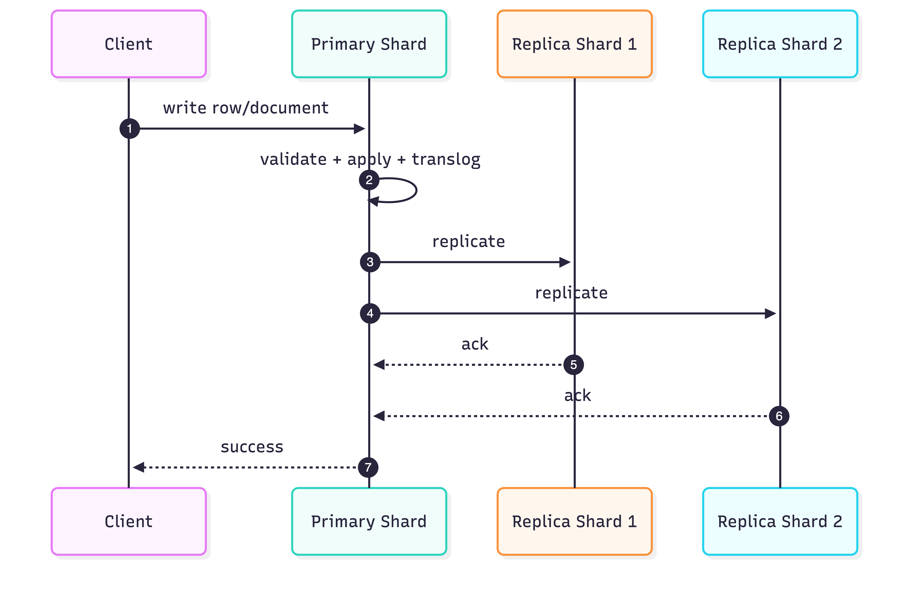

# Storage, Consistency, and Resiliency

## Storage model

- Every table is sharded across the cluster.
- Optional partitioning splits table data further by partition keys (for lifecycle and pruning).
- Each shard persists as Lucene-backed index data on local node storage.
- Writes pass through journal/translog before durable segment transitions.
- Replicas store independent shard copies for fault tolerance and read scalability.

## Write path



Write-path notes:

- Primary shard validates and applies writes first.
- Replicas acknowledge according to replication policy.
- Under backpressure/failures, retries and recovery paths preserve consistency semantics at shard level.

## Read path types

- Primary-key direct lookup path: immediate visibility semantics for key-based fetch/update loops.
- Search-style path (secondary attributes/full scans): near-real-time visibility with refresh cycles.

Use `REFRESH TABLE` when deterministic immediate search visibility is required.

## Read/visibility decision table

| Requirement | Recommended pattern | Tradeoff |
| --- | --- | --- |
| Immediate key-based verification after write | Primary-key lookup path | Works for key access, not broad search scans. |
| Immediate search visibility for user-facing query | `REFRESH TABLE` after write batch | Extra refresh overhead if overused. |
| Maximum ingest throughput | Rely on natural refresh cycle | Search visibility is near-real-time, not immediate. |

## Consistency model in practice

MonkDB does not provide multi-statement ACID transactions across arbitrary rows/tables.

Operationally important guarantees:

- Atomicity at row/document write unit.
- Durability via translog + shard replication.
- Near-real-time consistency for search readers.
- Stronger immediate behavior for point-lookups by key.

## MVCC and optimistic concurrency

MonkDB uses versioned document semantics suitable for optimistic concurrency patterns.

Typical pattern:

1. Read current row version/state.
2. Write with expected version constraints (application/API path).
3. Retry if conflict occurs.

## Refresh and visibility model

Search visibility depends on refresh cycles. For deterministic user flows:

- trigger `REFRESH TABLE <table>` after critical writes when immediate search visibility is required
- keep refresh usage scoped to avoid excessive refresh overhead

Example:

```sql
INSERT INTO doc.orders (id, amount) VALUES ('o-1', 120.0);
REFRESH TABLE doc.orders;
SELECT * FROM doc.orders WHERE id = 'o-1';
```

## Resiliency mechanics

- Replica promotion on primary loss.
- Automatic shard recovery and relocation after node events.
- Cluster master election with quorum requirements.

## Failure recovery flow


## Recovery and allocation diagnostics

Use system tables to track recovery health:

```sql
SELECT table_name, id, routing_state, state,
       recovery['stage'], recovery['size']['percent']
FROM sys.shards
WHERE routing_state IN ('INITIALIZING', 'RELOCATING')
ORDER BY table_name, id;
```

```sql
SELECT table_name, shard_id, node_id, explanation
FROM sys.allocations
WHERE explanation IS NOT NULL
ORDER BY table_name, shard_id;
```

## Data lifecycle controls

- Partitioned retention: drop old partitions cheaply.
- Tiering strategy: hot/warm/cold storage placement via operational shard moves.
- Snapshot/restore for disaster recovery and rollback workflows.

## Backup and disaster recovery posture

Recommended baseline:

1. Create repository early (`CREATE REPOSITORY`).
2. Schedule periodic snapshots (`CREATE SNAPSHOT`).
3. Test restore workflows (`RESTORE SNAPSHOT`) in staging.
4. Monitor snapshot state via `sys.snapshots` and repository metadata via `sys.repositories`.

## Related docs

- [Snapshots and Restore](../operations/snapshots-restore.md)
- [Diagnostics with System Tables](../operations/diagnostics-system-tables.md)
- [Memory and Circuit Breakers](../operations/memory-and-circuit-breakers.md)
