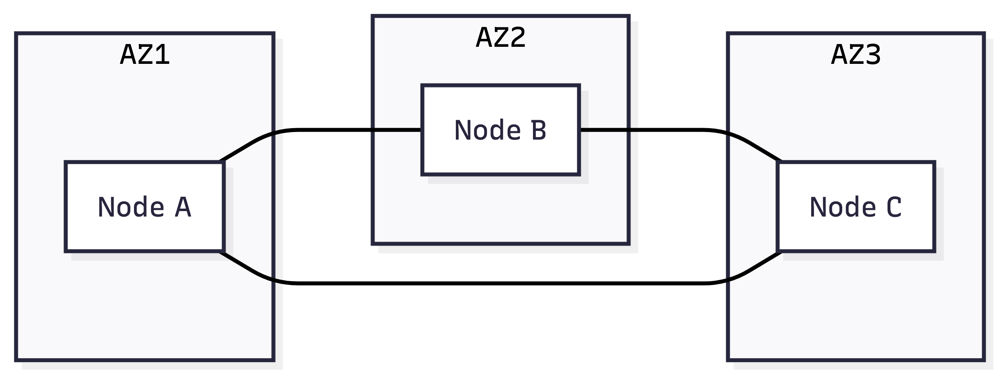
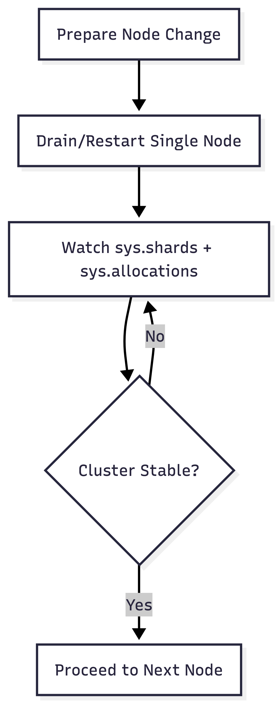

# Scaling and Clustering Principles

## Cluster sizing baseline

For production:

- Minimum 3 nodes for quorum-safe operations.
- Replication policy aligned with failure domain (node/rack/zone).
- Storage and heap sized for both ingest and query peaks.

## Capacity planning dimensions

Plan capacity across four dimensions:

- **CPU**: parse/plan/execute/merge pressure
- **Memory**: heap, breakers, intermediate result sets
- **Storage**: shard growth, replica multiplier, snapshot overhead
- **Network**: replication traffic, relocation bandwidth, distributed query fan-out

Use baseline load tests to capture steady-state and spike envelopes before production scale decisions.

## Horizontal scaling model

Scaling is additive:

- Add nodes -> more CPU, memory, and storage bandwidth.
- Rebalancing redistributes shards automatically.
- Query fan-out leverages additional shard workers.

Practical scale-out flow:

1. Add one node (or one failure domain) at a time.
2. Observe shard relocation (`sys.shards`, `sys.allocations`).
3. Validate query latency/throughput under live load.
4. Repeat incrementally.

## Scale trigger decision table

| Signal | Typical threshold pattern | Primary action |
| --- | --- | --- |
| Sustained high CPU | p95 node CPU near saturation during business peak | Add data nodes and rebalance shards. |
| Breaker trips under normal workloads | recurring query/request/parent breaker exceptions | Add memory/capacity and tune heavy queries. |
| Recovery windows too long | shard relocation/recovery exceeds SLO | Revisit shard sizing and node/storage class. |
| Read latency spikes with traffic growth | p95/p99 read latency degrades with stable query shapes | Increase replicas or add query capacity nodes. |

## Shard strategy guidance

- Too few shards: underutilized parallelism.
- Too many shards: metadata and scheduling overhead.

Choose shard counts based on:

- expected table growth
- concurrent query/write mix
- node count trajectory

## Shard count heuristics (operational)

- Keep shard sizes operationally manageable for recovery windows.
- Prefer predictable partitioning for time-series retention.
- Revisit shard strategy when node count changes materially.

## Replica strategy guidance

- More replicas improve read parallelism and fault tolerance.
- Replication increases write amplification and storage cost.

Tune per table according to workload criticality and SLA.

## Zone-aware resiliency pattern



Run quorum-capable topology across independent failure domains.

## Kubernetes scaling principles

- StatefulSet for data nodes.
- Persistent volumes per pod.
- Anti-affinity to avoid co-locating replicas.
- Scale gradually; monitor relocation pressure and query latency.

## Docker and VM scaling principles

- Keep node identity stable (`node.name`) and storage persistent.
- Avoid frequently recycling nodes with local-only storage.
- Use explicit discovery and master initialization settings for clustered deployments.

## Node-level vs cluster-level settings

Node-level examples:

- `network.*`, `path.*`, transport/http binding, local JVM heap.

Cluster-level examples:

- breaker limits (`indices.breaker.*`)
- governance/audit/lineage switches
- FDW local access gate (`fdw.allow_local`)

## Rolling operations

- Roll nodes one at a time where possible.
- Wait for shard stabilization before next node operation.
- Watch `sys.shards`, `sys.allocations`, `sys.nodes` throughout.

## Safe rolling-change sequence



## Scale troubleshooting checklist

```sql
SELECT name, load['1'], mem['used_percent'], heap['used']
FROM sys.nodes
ORDER BY name;

SELECT table_name, id, routing_state, state
FROM sys.shards
ORDER BY table_name, id;

SELECT table_name, shard_id, node_id, explanation
FROM sys.allocations
WHERE explanation IS NOT NULL
ORDER BY table_name, shard_id;
```

If latency rises during scale events, pause further node operations until relocation and breaker pressure stabilize.

## Related docs

- [Docker Compose (3-node)](../deployment/01-docker-compose-3node.md)
- [Production Topologies](../deployment/02-production-topologies.md)
- [Kubernetes Deployment Principles](../deployment/03-kubernetes.md)
- [Monitoring](../operations/monitoring.md)
