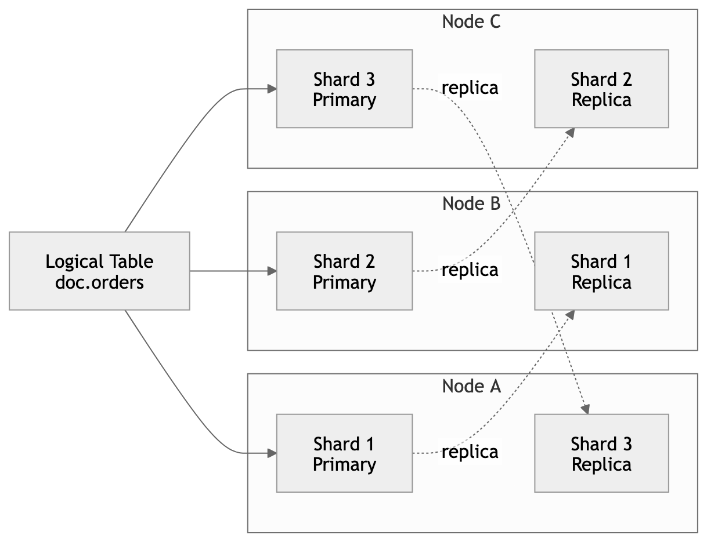
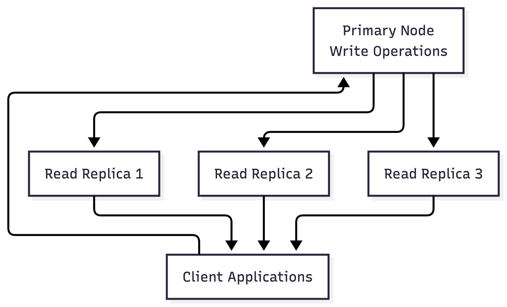
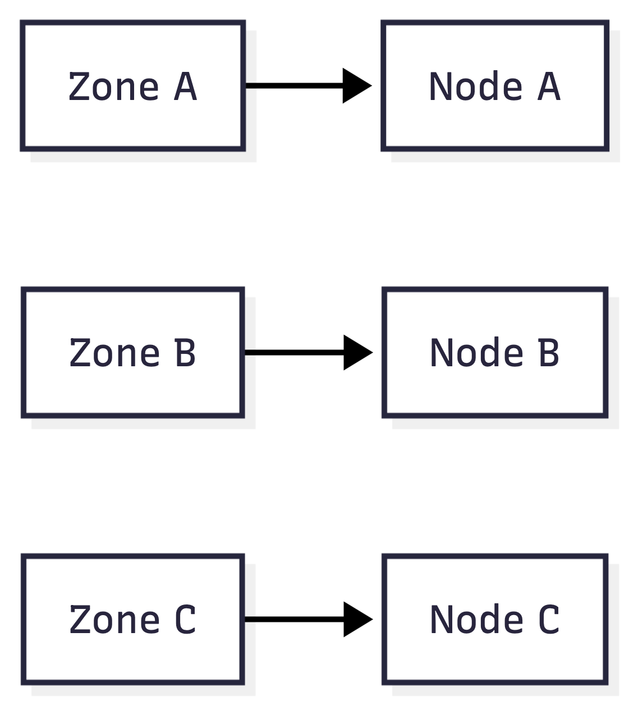

# Scaling and Clustering Principles

MonkDB supports flexible clustering patterns to match different workload shapes, operational preferences, and resiliency requirements.

Clusters can scale horizontally for distributed workloads or use primary–replica patterns for simpler read-scaling deployments.

---

# Supported Clustering Patterns

MonkDB supports two primary clustering models.

## 1. Distributed Shard-Based Cluster

- Tables are partitioned into shards distributed across nodes.
- Each shard has a **primary** and optional **replica copies**.
- Query execution fans out across shard holders.
- Reads and writes are distributed across the cluster.

**Best suited for:**

- Large datasets
- Mixed operational + analytical workloads
- High ingest throughput
- Distributed compute scaling



---

## 2. Primary with Read Replica Topology

A primary node handles write operations while replicas serve read traffic.

- Primary node processes writes
- Replicas maintain synchronized copies
- Replicas can serve read-heavy workloads
- Provides simple scaling for read-intensive applications

**Best suited for:**

- Read-heavy applications
- Simpler operational topology
- Controlled write workloads



---

# Cluster Sizing Baseline

For production deployments:

- Minimum **3 nodes** for quorum-safe distributed clusters
- Replication aligned with **failure domains** (node, rack, zone)
- Storage sized for **data growth + replicas**
- Memory sized for **query peaks and intermediate results**

For primary–replica deployments:

- Size primary node for **peak write load**
- Size replicas for **read concurrency**

---

# Capacity Planning Dimensions

Plan capacity across four dimensions.

## CPU

Handles:

- SQL parsing
- Query planning
- Execution
- Shard-level processing
- Distributed merge operations

## Memory

Memory usage includes:

- JVM heap
- Query intermediate results
- Circuit breakers
- Caches
- Distributed merge buffers

## Storage

Storage footprint includes:

- Shard data
- Replica copies
- Translog files
- Snapshot repositories

## Network

Network traffic includes:

- Shard replication
- Distributed query fan-out
- Shard relocation
- Recovery operations

Baseline load testing should measure:

- Steady-state performance
- Peak ingest behavior
- Worst-case query patterns

---

# Horizontal Scaling Model

Scaling behavior depends on deployment topology.

## Distributed Cluster Scaling

Adding nodes increases:

- Total CPU
- Total memory
- Storage capacity
- Distributed query workers

Shard allocation automatically redistributes data across nodes.

Distributed queries utilize additional shard workers as the cluster grows.

---

## Primary–Replica Scaling

Adding replicas increases:

- Read throughput
- Read concurrency
- Failover capacity

Write throughput remains bounded by the **primary node**.

Read/write separation reduces contention on the write path.

---

# Practical Scale-Out Flow

Recommended scaling procedure:

1. Add one node or failure domain at a time
2. Monitor shard relocation
3. Observe cluster health
4. Validate query latency and throughput
5. Expand incrementally

Monitor using:

- `sys.nodes`
- `sys.shards`
- `sys.allocations`

---

# Scale Trigger Decision Table

| Signal | Typical Pattern | Primary Action |
|------|------|------|
| Sustained high CPU | p95 node CPU near saturation | Add nodes and rebalance shards |
| Primary node saturation | write-heavy workload | Scale primary node or distribute writes |
| Breaker exceptions | memory pressure during queries | Increase memory capacity or tune queries |
| Long shard recovery times | recovery exceeds SLO | Reduce shard size or improve storage |
| Read latency spikes | p95/p99 read latency increases | Add replicas or additional nodes |
| Write latency increases | replication or I/O pressure | Review replication policy and storage |

---

# Shard Strategy Guidance

Shard count affects both performance and operational complexity.

## Too Few Shards

- Limited parallelism
- Underutilized cluster resources

## Too Many Shards

- Scheduling overhead
- Cluster metadata pressure
- Slower recovery operations

Choose shard counts based on:

- Expected dataset growth
- Node count trajectory
- Concurrent workload patterns

---

# Shard Size Heuristics

Operational recommendations:

- Keep shard sizes manageable for relocation
- Prefer predictable partitioning for time-series workloads
- Periodically review shard strategy as clusters grow

---

# Replica Strategy Guidance

Replicas improve:

- Read throughput
- Query parallelism
- Fault tolerance

Tradeoffs include:

- Increased storage usage
- Additional write amplification
- More recovery traffic

Replica count should reflect:

- SLA requirements
- Read concurrency
- Failure tolerance goals

---

# Zone-Aware Resiliency

Deploy clusters across independent failure domains when possible.

Examples:

- Availability zones
- Racks
- Physical hosts



Primaries and replicas should be distributed across zones to reduce correlated failures.

---

# Kubernetes Scaling Principles

Recommended patterns:

- Deploy data nodes using **StatefulSets**
- Assign **persistent volumes per pod**
- Configure **pod anti-affinity**
- Avoid placing shard replicas on the same node

Scale gradually and monitor relocation and query latency during scaling operations.

---

# Docker and VM Deployment Principles

Operational guidance:

- Maintain stable `node.name`
- Preserve persistent storage across restarts
- Avoid frequent recycling of data nodes
- Use explicit cluster discovery configuration

Replica nodes must resynchronize cleanly after restarts.

---

# Node-Level vs Cluster-Level Settings

## Node-Level Settings

Examples:

```
network.*
path.*
node.name
transport.*
http.*
JVM heap configuration
```

These settings apply only to the local node.

---

## Cluster-Level Settings

Examples:

```
indices.breaker.*
governance.*
audit.*
lineage.*
fdw.allow_local
```

These settings affect the entire cluster.

---

# Rolling Operations

Recommended approach:

- Perform node updates **one at a time**
- Allow shards to stabilize before continuing
- Monitor cluster health throughout operations

Key monitoring tables:

- `sys.nodes`
- `sys.shards`
- `sys.allocations`

---

# Scale Troubleshooting Checklist

```sql
SELECT name, load['1'], mem['used_percent'], heap['used']
FROM sys.nodes
ORDER BY name;
```

```sql
SELECT table_name, id, routing_state, state
FROM sys.shards
ORDER BY table_name, id;
```

```sql
SELECT table_name, shard_id, node_id, explanation
FROM sys.allocations
WHERE explanation IS NOT NULL
ORDER BY table_name, shard_id;
```

If latency increases during scale events:

- Pause further node operations
- Wait for shard relocation to complete
- Verify breaker pressure has stabilized

---

# Related Documentation

- [Docker Compose Deployment](../deployment/01-docker-compose-2node.md)
- [Production Topologies](../deployment/02-production-topologies.md)
- [Kubernetes Deployment Principles](../deployment/03-kubernetes.md)
- [Monitoring](../operations/monitoring.md)
